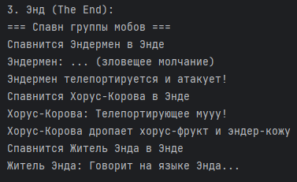
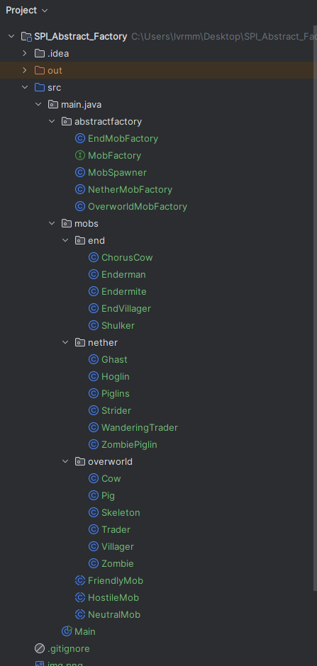
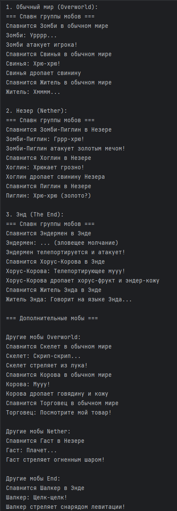

# Minecraft Mob Spawner System - Абстрактная Фабрика

## Описание проекта
Реализация системы спавна мобов в Minecraft с использованием паттерна проектирования «Абстрактная фабрика». Система создает группы тематически связанных мобов для разных измерений игры.

## Цель проекта
Демонстрация практического применения паттерна «Абстрактная фабрика» для создания семейств связанных объектов в игровой разработке.

## Архитектура системы

### Паттерн «Абстрактная фабрика» в действии

#### 1. **Абстрактная фабрика - `MobFactory`**
```java
public interface MobFactory {
    HostileMob createHostileMob();

    NeutralMob createNeutralMob();

    FriendlyMob createFriendlyMob();
}
```
#### 2. Конкретные фабрики
OverworldMobFactory - создает мобы обычного мира

NetherMobFactory - создает адские мобы

EndMobFactory - создает эндер-мобы

#### 3. Иерархия продуктов

##### Враждебные мобы (HostileMob)

| Измерение | Классы мобов |
|-----------|--------------|
| **Overworld** | `Zombie`, `Skeleton` |
| **Nether** | `ZombiePiglin`, `Ghast` |
| **End** | `Enderman`, `Shulker` |

##### Нейтральные мобы (NeutralMob)

| Измерение | Классы мобов |
|-----------|--------------|
| **Overworld** | `Pig`, `Cow` |
| **Nether** | `Hoglin`, `Strider` |
| **End** | `ChorusCow`, `Endermite` |

##### Дружелюбные мобы (FriendlyMob)

| Измерение | Классы мобов |
|-----------|--------------|
| **Overworld** | `Villager`, `Trader` |
| **Nether** | `Piglins`, `WanderingTrader` |
| **End** | `EndVillager` |

## Реализованные измерения и мобы
### Overworld (Обычный мир)
Враждебные:	Зомби, Скелет

Нейтральные: Свинья, Корова

Дружелюбные: Житель, Торговец
### Nether (Незер)
Враждебные:	Зомби-Пиглин, Гаст

Нейтральные: Хоглин, Страйдер

Дружелюбные: Пиглин, Странствующий торговец
### End (Энд)
Тип	Мобы
Враждебные: Эндермен, Шалкер

Нейтральные: Хорус-Корова, Эндермит

Дружелюбные: Житель Энда
## Пример работы программы
Код использования:
```java
// Создание фабрики для Энда
MobFactory endFactory = new EndMobFactory();
MobSpawner endSpawner = new MobSpawner(endFactory);

// Спавн группы мобов
endSpawner.spawnMobGroup();
```
Вывод в консоли:


## Структура проекта



## Критерии выполнения задания

Реализована абстрактная фабрика	- Выполнено

Конкретные фабрики для 3 измерений - Выполнено

Созданы все классы мобов (24 класса) - Выполнено

Реализован MobSpawner - Выполнено

Демонстрация работы в main	- Выполнено

Код компилируется без ошибок - Выполнено

Четкий вывод в консоль	- Выполнено

## Преимущества применения паттерна
### 1. Согласованность объектов
Все мобы, созданные одной фабрикой, гарантированно принадлежат одному измерению.

### 2. Гибкость и расширяемость
Для добавления нового измерения достаточно:

- Создать новую фабрику, реализующую MobFactory новые классы мобов
- Добавить новые классы мобов
- Не изменять существующий код

### 3. Инкапсуляция логики создания
Клиентский код (MobSpawner) не зависит от конкретных классов мобов.

### 4. Принцип открытости/закрытости
Система открыта для расширения (новые измерения), но закрыта для модификации.

## Пример вывода программы



## Результаты
Всего классов: 27

Интерфейсов: 1 (MobFactory)

Абстрактных классов: 3

Конкретных классов: 23

Измерений: 3

Мобов: 17 различных типов

## Вывод
Паттерн «Абстрактная фабрика» успешно применен для создания гибкой и расширяемой системы спавна мобов в Minecraft. Реализация демонстрирует:

Принципы SOLID - в частности, принципы открытости/закрытости и инверсии зависимостей

Чистую архитектуру - разделение ответственности между компонентами

Практическую пользу - паттерн идеально подходит для создания семейств связанных объектов

Проект полностью соответствует техническому заданию и служит отличным примером применения паттерна проектирования в игровой разработке.

Автор: [Игнатова Мария Евгеньевна БИВТ-23-СП-2]

Дата: [20.12.2025]

Паттерн: Абстрактная фабрика (Abstract Factory)

Язык: Java